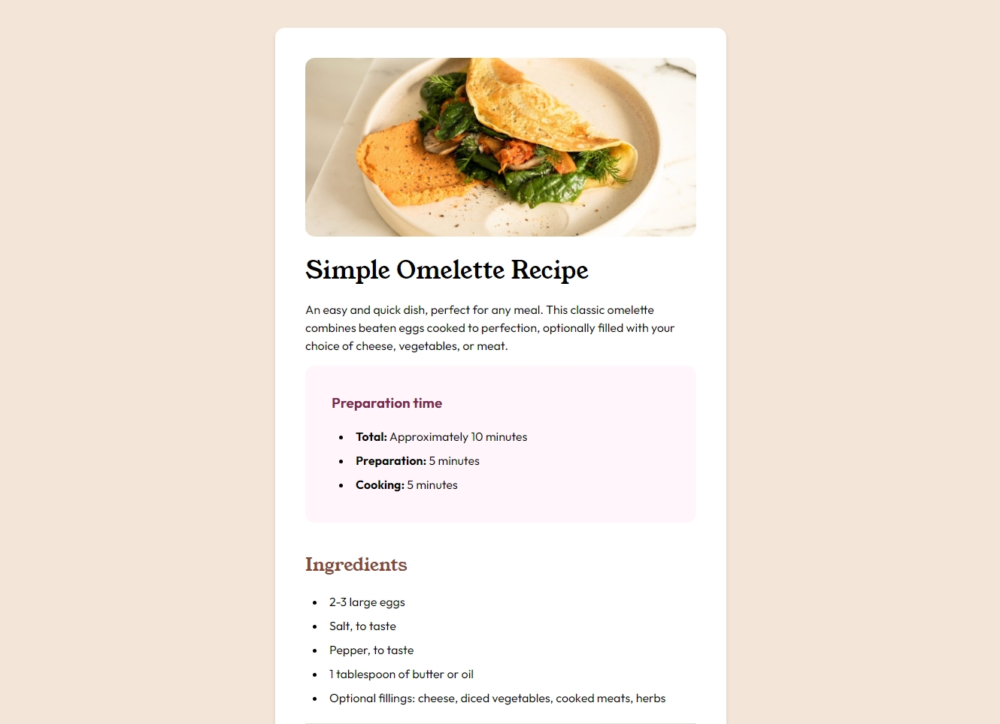

# Frontend Mentor - Recipe page solution

This is a solution to the [Recipe page challenge on Frontend Mentor](https://www.frontendmentor.io/challenges/recipe-page-KiTsR8QQKm). Frontend Mentor challenges help you improve your coding skills by building realistic projects. 

## Table of contents

- [Overview](#overview)
  - [The challenge](#the-challenge)
  - [Screenshot](#screenshot)
  - [Links](#links)
- [My process](#my-process)
  - [Built with](#built-with)
  - [What I learned](#what-i-learned)
  - [Continued development](#continued-development)
  - [Useful resources](#useful-resources)
- [Author](#author)
- [Acknowledgments](#acknowledgments)

**Note: Delete this note and update the table of contents based on what sections you keep.**

## Overview

### Screenshot



### Links

- Solution URL: [Add solution URL here](https://your-solution-url.com)
- Live Site URL: [Add live site URL here](https://your-live-site-url.com)

## My process

### Built with

- Semantic HTML5 markup
- CSS custom properties
- Flexbox
- CSS Grid
- Mobile-first workflow

### What I learned

- Use of semantic html: strong, aria-labelledby, role attributes
- Using grid to represent tabular data
- importing defined variables in css
- using imported fonts in one's project
- Colour representation in: hsl, rgba, hex values


```html
<section aria-labelledby="nutrition">...</section>
<li><strong>Beat the eggs:</strong> In a bowl, beat the eggs with...</li>
<footer class="attribution" role="contentinfo"></footer>
```
```css
@font-face {
    font-family: Outright;
    src: url(../assets/fonts/outfit/Outfit-VariableFont_wght.ttf);
}

:root {
    --nutmeg: hsl(14, 45%, 36%);
    --dark-raspberry: hsl(332, 51%, 32%);
    --white: hsl(0, 0%, 100%);
    --rose-white: hsl(330, 100%, 98%);
    --eggshell: hsl(30, 54%, 90%);
    --light-grey: hsl(30, 18%, 87%);
    --wenge-brown: hsl(30, 10%, 34%);
    --dark-charcoal: hsl(24, 5%, 18%);
    --focus-outline: hsl(208, 100%, 50%);
}
```
### Continued development

I keep learning the best ways to implement semantics in html structure. I want this to be part of my package
in every development, so, I hope to keep learning these techniques.

I want to be critical in breaking down css properties into different files for easier restyling. On styling,
figma is going to be the next asset in my repertoire. Replicating the styles is good, but reinventing is better.

### Useful resources

- [ChatGpt 4.0](https://www.openai.com) - This helped in identifying areas of poor accessibilityin my
html structure

## Author

- Website - [Bart254](https://www.your-site.com)
- Frontend Mentor - [@Bart254](https://www.frontendmentor.io/profile/Bart254)
